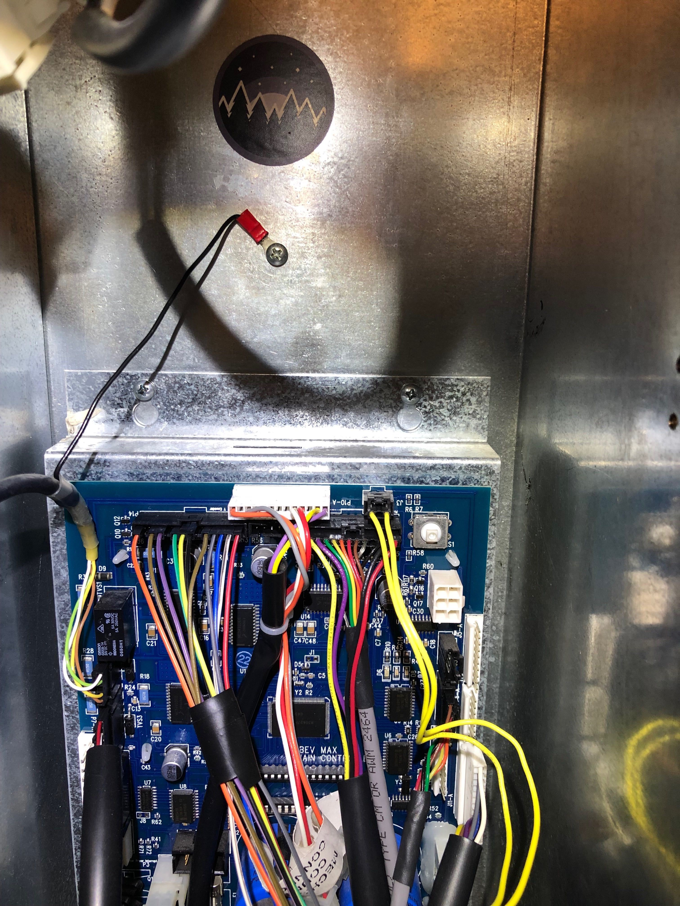
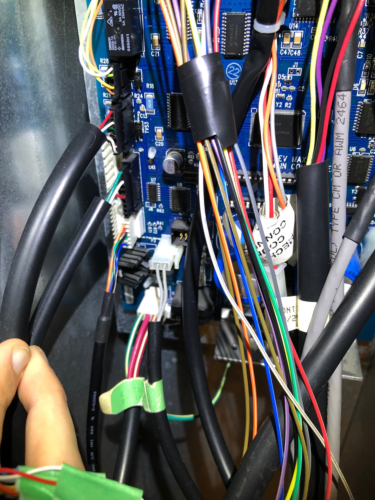
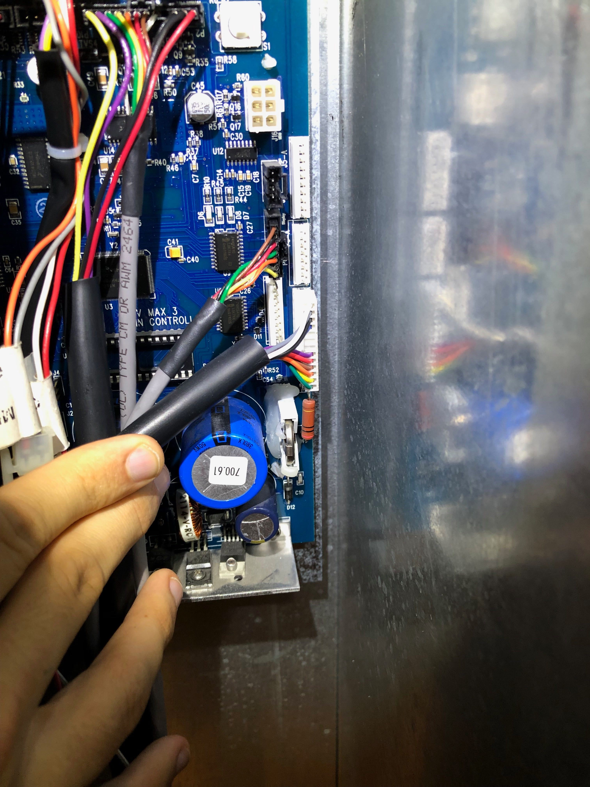
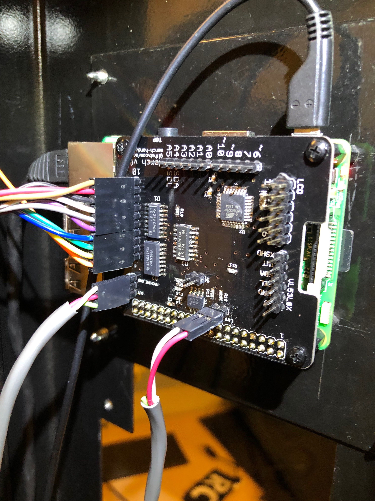
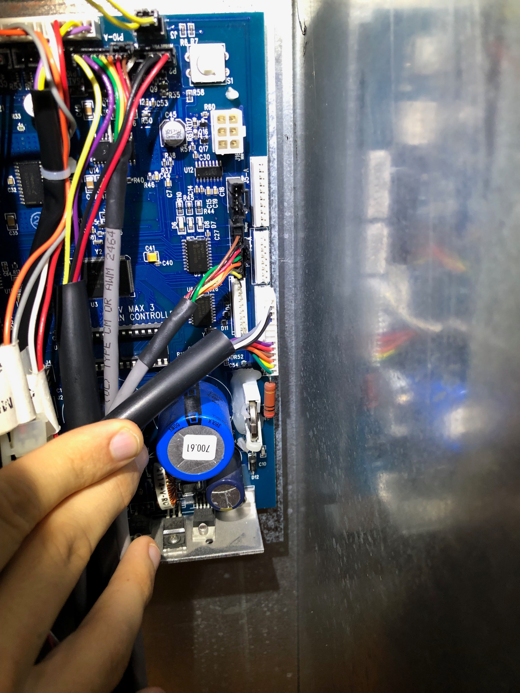
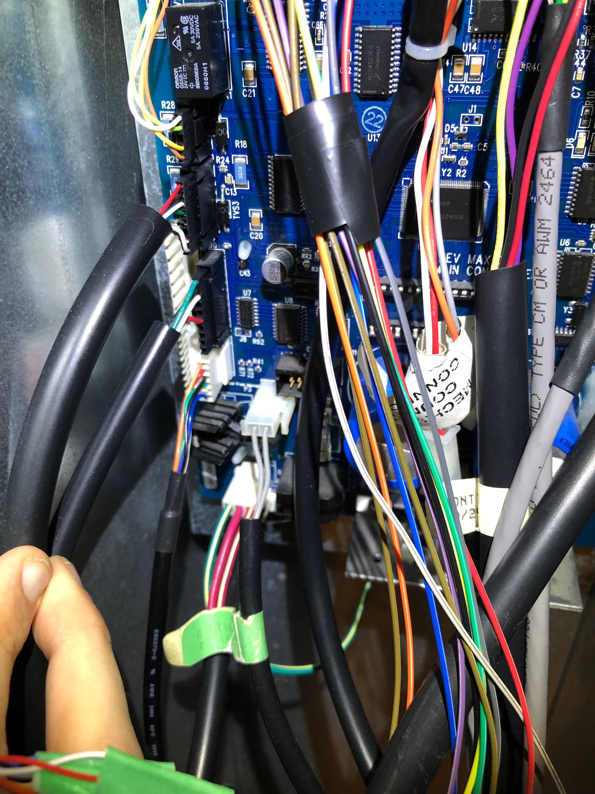
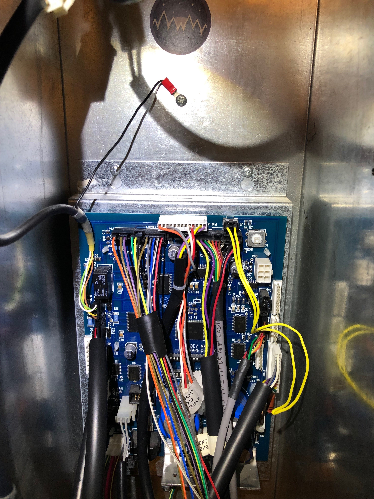
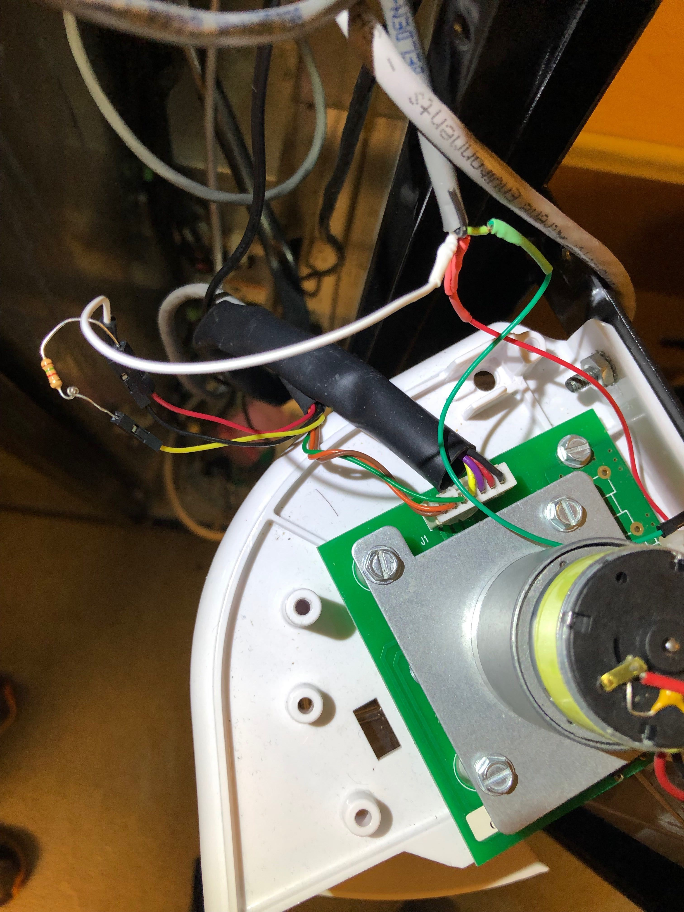

# Hardware to make Merch function

All the designs for the hardware components of Merch are found here.

## Components

### Merch Hat

This unofficial Raspberry-Pi Hat allows a Pi to emulate keypresses on the machine's keypad.

### iPad Mount

### Connection Pictures

